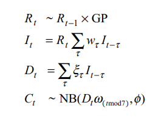

```{r setup, include=FALSE}
knitr::opts_chunk$set(echo = FALSE)
```

# Abstract

The second wave of COVID-19 in India has caused a devastating crisis, saddening scenes of people grappled due to shortage of oxygen supplies and poor health facilities has shook the entire world. Especially Nepal, who shares a long open border with India, the surge in the cases compelled thousands of migrant workers to return, is currently facing a ripple effect of India's Covid crisis, which has induced a skyrocketing increase in the confirmed cases. Therefore, the analysis of its trend of COVID-19 in Nepal and also, forecasting the potential circumstances that the country might have to face can be regarded as indispensable. An effective tool to interpret the possibilities of the current situation is the reproduction number or the "R number" which helps to know about the transmission of the virus and consequently the measures to be adopted to "break the chain". So, we have used the daily counts of confirmed cases and deaths reported from John Hopkins University GitHub repository and also the data from Our World in Data website from January to April 2021 to estimate the abrupt changes in the instantaneous reproductive number. The model has produced an average value of 1.4 for the R number which is alerting as Nepal is subjected to poor health infrastructures, inadequate supply of drugs, poor retention of human resources and a low vaccination rate. Thus, along with implementation of a strict lock down, the government needs to be more effective in managing its border, increase the oxygen supplies, isolate all the confirmed cases, fasten its vaccination process, provide quality care for the older adults and those with morbidity and spread awareness about the how fatal the COVID-19 crisis can transform into if the appropriate health measures are not immediately adopted.

# Introduction

The reproduction number (R) is the average number of secondary infections produced by a single infected person. R number can have range of positive value. If R is greater than 1, this means the epidemic is growing faster and if R number is less than 1, the epidemic is shrinking [4].

A R number of 2 means there will be two people infected today, four tomorrow, eight the next day, and so on is fallacious as the R number is affected by time, space, society and public policies each of which are subjected to constant change. These factors are the reasons why R number changes over time. For example, R number will fall when there is a reduction in the numbers of contact between peoples whereas it will rise if contact between people increases.

To be precise, R number is part of a bigger picture which includes:

-   The severity

-   The number of cases of the infection.

Many countries in the world are using R number to make decisions about lifting and bringing in lock downs, what restrictions should be kept in place and which ones should be lifted (Source: BBC).

The main objective of the study is to estimate R number for Nepal using the data available from Our World in Data and John Hopkins University.

## Review of literature

Chu (2019) published a research article "A Statistical analysis of the novel corona virus in Italy and Spain". The main objective of the study were:

-   To model the incidence of COVID -19 in Italy and Spain using simple mathematical models in epidemiology.

-   To provide estimates of basic measures of the infectiousness and severity of COVID 19 in Italy and Spain.

-   To investigate the predictive ability of simple mathematical models and provide simple forecasts for the future incidence of COVID 19 in Italy and Spain.

The data used in the study consisted of the daily and cumulative incidence of COVID-19 for Italy and Spain nationally as well as their respective regions or autonomous provinces. Italy data covered 21 regions for 37 days from 21st February to 31st March 2020. For Italy, the data were collected from the Italian Department of Civil Protection. Similarly for Spain, Spain data were collected from the Spanish Ministry of Health.

After using two mathematical epidemiological models- The susceptible-Infectious-Recovered model and log-linear regression model, estimation of the basic reproduction number were found to be larger than 1 in both countries with values being between 2 and 3 for Italy and 2.5 and 4 for Spain. Moreover, the estimation for the more dynamic reproduction number showed the decrements in the severity in respective countries since the first cases were confirmed.

The predictive ability of the log-linear regression model was found to give a better fit and also simple estimates of the daily incidence for both countries were computed.

White, Letchford, Pokhrel, Lata and Zaman (2020) published a research article "Modeling of COVID- 19 Strategies in Nepal". The objectives of the study were:

-   Explore the potential effects of various future strategies on the time of the peak of the disease burden in Nepal.

-   Predict the potential impact of limitations in health system capacity, including hospital beds and critical care units, during the epidemic.

-   Identify the impact of potential strategies of release from the current interventions in place and

-   Identify priorities for further research.

The study developed a SEIR (Susceptible, Exposed, Infectious, and Recovered) compartmental model. The model used a series of age-stratified deterministic ordinary differential equations, implemented in the statistical software R. The model took a system-wide perspective on modeling the overall impact of COVID-19 on the healthcare system in Nepal. The study analyzed the impact of three disruption strategies, labeled the 'low disruption strategy', 'medium disruption strategy', and 'high disruption strategy'. Each strategy differed by the degree of social and economic disruption. Under the low disruption strategy, the model estimated 81% of the population to be infected by the end of the year and peak would occur between June and September. The model estimated COVID-19 could result in 49200 deaths by the end of the year, which would be roughly 25% of all-cause mortality. Similarly, the model estimated the medium disruption strategy would reduce the burden of the disease by approximately 5000 cumulative deaths compared to the low disruption strategy, accounting for 23% of all-cause mortality by the end of the year and the peak of infection would occur between July and October. The high disruption strategy incurred the lowest number of deaths, reducing the cumulative mortality by approximately 15800 deaths compared to the low disruption strategy, which would account for 19% of all-cause mortality by the end of the year and the peak of infection would occur between June and September.

# Data

We have used daily counts of confirmed cases and death s reported from John Hopkins University github repository. Also, we have used data from Our World in Data website. These source has fetched the data from Ministry of Health and Population(MoHP) Nepal. All the analysis described below are for Nepal.

In this research, our aim is to estimate R number for second wave of Covid-19. So, we have only used data since January 2021.

# Model

## Time interval between case onset and reported

In order to estimate the time gap between cases onset and reported, we fit a log normal distribution, using the statistical modeling program stan, to 100 sub sampled bootstraps (each with 250 samples drawn with replacement ) of the available data. To account left and right censoring in the data, we have rounded each date to the nearest day and truncated to the maximum observed delay.

.........................

## Estimate the time-varying R number

To estimate the $R_0$ , we have used *EpiNow2* R package on the available data, discarding the data that is less than 50. The $R_0$ represents the number of secondary cases arising from an individual showing symptoms at a particular time, assuming that conditions remain identical after that time, and is therefore a measure of the instantaneous transmissibility (Fraser,2007).

EpiNow2 uses a Bayesian latent variable approach using the probabilistic programming language Stan, which works as follows.The initial number of infections were estimated as a free parameter with a prior based on the cases respectively. For each subsequent time step, previous imputed infections I(t-1) were summed, weighted by an uncertain generation time probability mass function (w), and combined with an estimate of R(t) to give the incidence at time t as I(t). We used a log normal prior for the reproduction number of $R_0$ with mean 1.5 and standard deviation 0.5 reflecting our current belief that $R_t$ is likely to be centered around 1 in Nepal. The infection trajectory were then mapped to mean reported case counts $D_t$ by convolving over an uncertain incubation period and report delay distribution. The observed reported case counts were then assumed to be generated from a negative binomial model with overdispersion $\phi$ and mean $D_t$ multiplied by a day of the week effect with an independent parameter for each day of the week. Temporal variation was controlled using an appropriate Gaussian process with a squared exponential kernel (GP). In mathematical notation,

{width="100"}

The parameters of the Gaussian process kernel were estimated during model fitting with the following priors. The length scale was given an inverse gamma prior with shape and scale values optimized to give a distribution with 98% of the density between 2 days and 21 days. The prior on the magnitude was standard normal Each time series was fit independently using Markov-chain Monte Carlo (MCMC). A minimum of 4 chains were used with a warm up of 500 each and 4000 samples post warm up. Convergence was assessed using the R hat diagnostic.

## Estimating the daily growth rate and doubling time

We estimated the rate of spread (r) by converting our $R_t$ estimates using an approximation derived in [ ]. The doubling time was then estimated by calculating $ln(2)$$1/r$ for each estimate of the rate of spread.

# Results

```{r}
source("data.R")
source("pkg.R")


np_df$date <- lubridate::mdy(np_df$date)
df <- np_df%>%
  pivot_longer(cols = c("recovered","confirmed"),
               names_to = "status",
               values_to = "value")
df%>%
  ggplot()+aes(x=date,y=value)+
  geom_point(aes(col=status))+
  facet_wrap(~status)+
  ggtitle("Cumulative Confirmed and Recovered in Nepal")


```

The above figure shows t

```{r}
df%>%
  ggplot()+
  aes(x=date,y=death)+
  geom_point(size=0.5)+
  geom_line(col="blue")

```

# Conclusion

In the present context, the world is facing second wave and third wave of Covid-19 pandemic where people are being infected in millions in a day. In this situation, it is very important to understand how the pandemic is spreading around us. R number plays a significant role in understanding the situation of the corona virus.

In order to control Covid-19, country should aim to reduce R number below 1. That requires limitations of physical interaction which is challenging task. As we have found R number of 1.4 for Nepal, we should also aim to reduce it. But our country is facing the following challenges

## Limitations of R number

The R number depends on the assumptions about the transmission characteristics of the virus. So, we also need to consider the means of transmission. The estimates about the mortality rate vary in terms of how fatal the virus is, which is again partly based on the highly variable nature of data collection between countries, plus variations relating to testing regimes and also with the accuracy of test kits. Moreover, there can be many asymptomatic carriers. Further, R is also very general as it cannot tell us the difference in terms of infection rates between a hospital, care home, workplace, and wider community and so on . We also have to consider the differences between the number of people who are currently infectious as well as the recorded number of new infections because if the number of cases of infection rises, the effective R should fall as there will be less people who could get infected. However, the drop in R doesn't mean a reduction in the number who are infected. Hence, we should also consider the proportion of the population that remains susceptible to infection. Thus, it is quite difficult to get the good estimates of the R number as it is not a biological constant.

## Challenges in controlling R number in Nepal

Nepal shares a long porous border with India. In this moment, India is facing a massive spread of this virus and the condition is very critical. Due to which it becomes more challenging to control R number in Nepal. The large number of migrant workers are returning back to Nepal from highly affected areas of India but testing and isolation are not being done rather they are mixed to society. Similarly, the number of testing, contact tracing are very very low. It creates a threat of even greater increase in R number.

Government of Nepal has imposed prohibitory orders like lock down currently but people in the city areas were allowed to return their villages. This movement of people can lead to spread virus to rural areas of Nepal. In cities areas, even at a lock down period, people are coming out for buying daily essentials. This means the objective of lock down to limit the physical interaction has not been achieved. More of, government has already imposed .....months lock down which has already damaged our weak economy so even if government wants to extend it, it will be very difficult. This situation creates a challenge in controlling R number. Further cities areas in Nepal are highly dense, this creates a chance of super spreading. Still, peoples are not following safety measures properly, gathering in public events are still going on. As the hospitals are not managed properly, the hospitals itself become a source of spreading.

# Suggestions

The best practice to reduce the R number is to limit physical interactions between human beings. For this, we need to test and isolate the Covid positive. Government should impose strict lock down where people are not allowed to come out from home except emergency cases. People should follow strictly health and safety protocol. Government should allow the migrant workers to come to Nepal through specified check point and they should be tested and compulsorily quarantined whether they are positive or not. Awareness campaign should be launched through different medium and make people understand the seriousness of the situation. Along with this,massive vaccination campaign should be started as soon as possible. Rumors about vaccination should be addressed and clarified and more information should be circulated.

All of the above suggestions should be strictly implemented in order to reduce R number less than 1.

# Reference

[1] Abbott S, Hellewell J, Thompson RN *et al.* Estimating the time-varying reproduction number of SARS-CoV-2 using national and subnational case counts [version 2; peer review: 1 approved with reservations]. *Wellcome Open Res* 2020, **5**:112 (<https://doi.org/10.12688/wellcomeopenres.16006.2>)

[2] Professor Lisa White, Dr Nicholas Letchford, Dr Sunil Pokharel, Dr Dipti Lata, Dr Rashid Zaman (May 2020) Modelling of COVID-19 Strategies in Nepal. Oxford Policy Management, Oxford Policy & Analysis for Health of the Nuffield Department of Medicine, University of Oxford.

[3] Chu J (2021) A statistical analysis of the novel coronavirus (COVID-19) in Italy and Spain. PLoS ONE 16(3): e0249037. <https://doi.org/10.1371/journal.pone.0249037>

[4] <https://www.gov.uk/guidance/the-r-value-and-growth-rate>

[5] <https://en.wikipedia.org/wiki/COVID-19_pandemic_in_Nepal>

[6] <https://github.com/epiforecasts/EpiNow2>

[7] <https://github.com/CSSEGISandData/COVID-19>

[8] <https://ourworldindata.org/coronavirus-testing>

[9] Stan Development Team: RStan: The r interface to stan. 2020. [Reference Source](http://mc-stan.org/)
